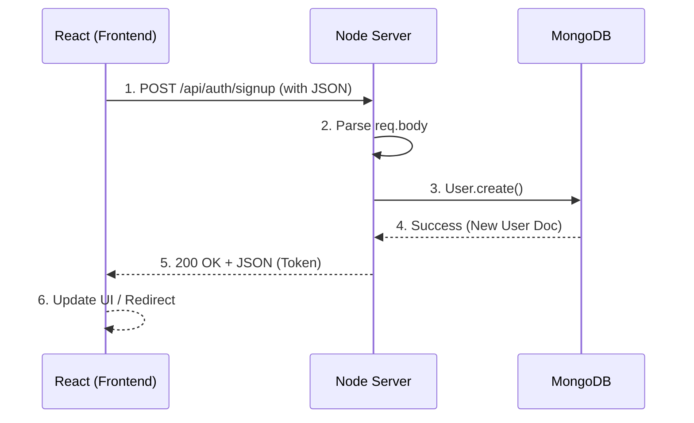

# Charity Connect: Code Walkthrough Guide

Use this guide for your "Demo Tips & Code Walkthrough" section (10 minutes).

---

## 🟢 Part 1: Sign Up Flow (End-to-End)

**Goal**: Demonstrate how a user is created, moving from React state to the Database.

### **1. Frontend: React State & API (File: `frontend/src/pages/SignUp.jsx`)**

*   **Step A: Handling Input (Lines 10-15)**
    ```javascript
    const [formData, setFormData] = useState({
      fullName: '',
      email: '',
      password: '',
      confirmPassword: '',
    })
    ```
    *   **Explain**: "We use the `useState` hook to temporarily store what the user types in `formData`."

*   **Step B: Submitting Data (Lines 27, 48-52)**
    *   *Scroll to `handleSubmit`*
    ```javascript
    const response = await authAPI.signup({
      fullName: formData.fullName,
      email: formData.email,
      password: formData.password,
    })
    ```
    *   **Explain**: "When input is submitted, we call `authAPI.signup`. This sends the `formData` as a JSON POST request to our backend."

### **2. Backend: Controller Logic (File: `backend/controllers/authController.js`)**

*   **Step C: Receiving Request (Line 19)**
    ```javascript
    const { fullName, email, password } = req.body;
    ```
    *   **Explain**: "The server catches the request here. We use destructuring to pull the name, email, and password from `req.body`."

*   **Step D: Validation (Lines 21-22)**
    ```javascript
    let user = await User.findOne({ email });
    if (user) return res.status(400).json({ ... });
    ```
    *   **Explain**: "We check MongoDB to make sure the email isn't already used."

*   **Step E: Saving to DB (Lines 25-26)**
    ```javascript
    user = new User({ fullName, email, password });
    await user.save();
    ```
    *   **Explain**: "This is the core action. `user.save()` inserts the new record into the MongoDB database."

*   **Step F: Response (Line 32)**
    ```javascript
    res.json({ token, user: ... });
    ```
    *   **Explain**: "Finally, we send back a success response with a JWT token so the user is logged in instantly."

---

## 🔵 Part 2: Volunteer Application & Approval (Bonus/Advanced)

**Goal**: Show a complex flow where an Admin approves a request and the system updates user permissions.

### **1. Frontend: Application Form (File: `frontend/src/pages/VolunteerApply.jsx`)**

*   **Key Code**: `handleSubmit` (Lines 85+)
    ```javascript
    await volunteersAPI.apply(formData)
    ```
    *   **Explain**: "Just like Sign Up, we collect skills/interests and POST them to the backend."

### **2. Backend: Creating Application (File: `backend/controllers/volunteerController.js`)**

*   **Key Code**: `createVolunteer` (Lines 8-41)
    ```javascript
    const existingVolunteer = await Volunteer.findOne({ ... }); // Check duplicates
    const volunteer = await Volunteer.create(req.body); // Save application
    ```
    *   **Explain**: "We prevent duplicate applications first, then create the record with a default status of **Pending**."

### **3. Admin Approval Logic (File: `backend/controllers/volunteerController.js`)**

*   **Key Code**: `updateVolunteerStatus` (Lines 82-114)
    *   *Focus on this specific logic block (Lines 112-114):*
    ```javascript
    // If approved, we could update the user role to 'volunteer'
    if (status === 'approved' || status === 'active') {
        await User.findByIdAndUpdate(volunteer.userId._id, { role: 'volunteer' });
    }
    ```
    *   **Explain (CRITICAL)**: "This is the business logic magic. When an Admin clicks 'Approve', we don't just change the application status. We ALSO automatically find the User account and upgrade their role to `volunteer`. This grants them new permissions immediately."

### **4. Frontend: Admin Dashboard (File: `frontend/src/pages/AdminDashboard.jsx`)**

*   **Key Code**: `handleVolunteerStatusUpdate` (Line 70)
    *   **Explain**: "This function connects the 'Approve' button on the dashboard to that backend logic."

---

## 🟡 Part 3: React & JS Deep Dive (Frontend Focus)

**Goal**: Explain the core technical concepts of React as requested by the rubric.

### **1. Core Concepts: `useState` & `useEffect`**

*   **Concept**: `useState`
    *   **File**: `frontend/src/pages/SignUp.jsx` (Line 10)
    *   **Code**: `const [formData, setFormData] = useState(...)`
    *   **Explain**: "React components need memory. `useState` gives us a variable (`formData`) to store data and a function (`setFormData`) to update it. When data updates, the screen re-renders automatically."

*   **Concept**: `useEffect`
    *   **File**: `frontend/src/pages/Campaigns.jsx` (Line 12)
    *   **Code**:
        ```javascript
        useEffect(() => {
          fetchCampaigns()
        }, [])
        ```
    *   **Explain**: "`useEffect` handles side-effects. Here, we tell React: 'When this component first loads (mounts), go fetch the campaign data from the API.' The empty array `[]` means 'do this only once'."

### **2. Dynamic Rendering: `map()`**

*   **Concept**: `map()`
    *   **File**: `frontend/src/pages/Campaigns.jsx` (Line 89)
    *   **Code**:
        ```javascript
        {campaigns.map((campaign) => (
          <div key={campaign._id}>...</div>
        ))}
        ```
    *   **Explain**: "We don't hardcode lists. We take our array of `campaigns`, and use `.map()` to loop through them, transforming each data object into a JSX Card component. The `key` prop helps React track updates efficiently."

### **3. Event Handling & Controlled Inputs**

*   **Concept**: Controlled Inputs
    *   **File**: `frontend/src/pages/SignUp.jsx` (Line 188)
    *   **Code**:
        ```javascript
        <input value={formData.fullName} onChange={handleChange} />
        ```
    *   **Explain**: "This is a 'controlled input'. The text inside the box is strictly tied to our React state (`value={...}`). When a user types, it triggers `onChange`, which updates the state, which then updates the input value. This ensures our data is always in sync."

*   **Concept**: Form Submission
    *   **File**: `frontend/src/pages/SignUp.jsx` (Line 27)
    *   **Code**: `const handleSubmit = async (e) => { e.preventDefault(); ... }`
    *   **Explain**: "We stop the default browser refresh (`preventDefault`). Then we gather our state data and fire our custom API function."

---

## 🟣 Part 4: Database Interaction

**Goal**: Explain where data lives and how we access it (CRUD).

### **1. Data Storage: MongoDB**

*   **Explain**: "All our data (users, campaigns, donations) lives in **MongoDB**. It's a NoSQL database, which means it stores data in JSON-like documents rather than rigid tables. This flexibility is perfect for things like 'Campagins' which might have different fields in the future."

### **2. CRUD: Reading Data (Simple Query)**

*   **Concept**: Reading from the DB
    *   **File**: `backend/controllers/campaignController.js` (Line 6)
    *   **Code**: `getCampaigns`
        ```javascript
        const campaigns = await Campaign.find().sort('-createdAt');
        ```
    *   **Explain**: "This is a standard Mongoose query.
        *   `Campaign` is our model (the definition).
        *   `.find()` asks MongoDB for ALL records in that collection.
        *   `.sort('-createdAt')` orders them so the newest ones show up first."

### **3. The Communication Flow**

*   **Explain**: "The backend doesn't 'talk' directly to the hard drive. It uses a library called **Mongoose**.
    1.  **Node.js** sends a command (e.g., `find`).
    2.  **Mongoose** translates that into MongoDB protocol.
    3.  **MongoDB** executes the lookup and returns the data.
    4.  **Backend** sends that data back to the frontend as JSON."

---

## 🔁 Part 5: End-to-End Feature Walkthrough (Visual Summary)

**Goal**: Summarize the full cycle of a request (Adding a User) as a cohesive story.

### **The Diagram**



### **The 5-Step Script (Read this out loud!)**

1.  **React form → fetch("/api/users", POST)**
    *   *Action*: "User types name/email and hits Submit."
    *   *Code*: `SignUp.jsx` calls `authAPI.signup()`.

2.  **Node server → reads req.body**
    *   *Action*: "Express receives the request."
    *   *Code*: `authController.js` says `const { email } = req.body`.

3.  **DB → adds user**
    *   *Action*: "Mongoose takes that data and writes it to the database."
    *   *Code*: `await user.save()`.

4.  **Node server → responds with JSON**
    *   *Action*: "Server says 'Mission Accomplished' and sends back a token."
    *   *Code*: `res.json({ token: ... })`.

5.  **React → updates UI dynamically**
    *   *Action*: "React gets the token, saves it, and sends us to the Dashboard!"
    *   *Code*: `navigate('/dashboard')`.

---

## 🏆 Part 6: Winning the "High-Weight" Points (Rubric Checklist)

**Goal**: Ensure you hit every specific requirement on the user's grading sheet.

### **1. "Manual Node Server & Routing Logic"**
*   **Context**: You are using Express, which simplifies manual Node routing, but you must explain the *logic*.
*   **Say this**: "While raw Node.js requires big `if (req.url === '/...')` blocks, we use **Express Router** to organize this cleanly.
    *   In `server.js`, we mount the auth routes: `app.use('/api/auth', authRoutes)`.
    *   This acts like a traffic director. Any request starting with `/api/auth` is sent to `routes/auth.js`.
    *   Inside `routes/auth.js`, we map specific methods (POST) and paths (`/signup`) to specific Controller functions."

### **2. "Data Flow: UI → API → DB → Response → UI"**
*   **Context**: You demonstrated this in Part 5.
*   **Say this**: "My End-to-End demo showed the complete circle:
    1.  **UI**: User Input in React State.
    2.  **API**: Axios POST request.
    3.  **DB**: Mongoose Model `.save()`.
    4.  **Response**: JSON confirmation.
    5.  **UI**: React Router redirects to Dashboard."

### **3. "React State, Props, and Rendering"**
*   **Context**: We covered State and Rendering. **Props** is the missing keyword.
*   **Feature**: Campaign Cards.
*   **File**: `frontend/src/pages/Campaigns.jsx`
*   **Say this**: "When we use `.map()` to create the list of campaigns, we are passing data down to each element. If we extracted a single Campaign Card into its own component, we would pass the `campaign` object as a **Prop**. This makes the data flow one-way: from the parent list to the child card."

---

## 📝 Demo Checklist
1. [ ] Open `SignUp.jsx` (Frontend)
2. [ ] Open `authController.js` (Backend)
3. [ ] Open `VolunteerApply.jsx` (Frontend)
4. [ ] Open `volunteerController.js` (Backend)
5. [ ] Have this guide open on a second screen or printed out!
